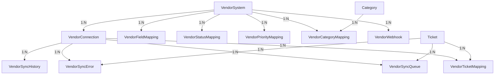

# Vendor Integration Data Model Documentation

## Overview

The vendor integration data model for the PIO Help Desk system is designed to support bidirectional ticket synchronization with external vendor ticketing systems while preserving Serbian language content integrity. The model provides a flexible, scalable architecture that can integrate with various vendor systems (JIRA, ServiceNow, Zendesk, etc.) through a unified data structure.

## Core Design Principles

1. **Serbian Language Support**: All text fields support UTF-8 encoding for proper Serbian Cyrillic and Latin character handling
2. **Bidirectional Synchronization**: Support for both inbound and outbound data flow with conflict resolution
3. **Flexible Mapping**: Configurable field, status, priority, and category mappings between systems
4. **Error Resilience**: Comprehensive error tracking and retry mechanisms
5. **Audit Trail**: Complete synchronization history for compliance and debugging

## Database Schema Components

### 1. VendorSystem
Central configuration for each vendor system type.

**Key Fields:**
- `name`: Unique system identifier
- `displayName`: Serbian-friendly display name
- `vendorType`: System type (jira, servicenow, zendesk, etc.)
- `supportsBidirectional`: Whether system supports two-way sync
- `supportsWebhooks`: Real-time update capability
- `rateLimitPerMinute`: API rate limiting configuration

**Purpose**: Define vendor system capabilities and constraints.

### 2. VendorConnection
Individual connection instances to vendor systems.

**Key Fields:**
- `connectionName`: Serbian name for the connection
- `authType`: Authentication method (oauth2, api_key, basic)
- `authConfig`: Encrypted authentication credentials
- `syncDirection`: Data flow direction control
- `pollingInterval`: Update frequency for polling-based sync

**Purpose**: Manage multiple connections to the same or different vendor systems.

### 3. Mapping Tables

#### VendorFieldMapping
Maps fields between internal and vendor systems.

**Features:**
- Entity type support (ticket, comment, attachment, user)
- Field transformation configuration
- Direction control (inbound/outbound/bidirectional)
- Default values with Serbian content support

#### VendorStatusMapping
Maps ticket statuses between systems.

**Example Mappings:**
```
Internal Status -> Vendor Status
new             -> Open
in_progress     -> In Progress
resolved        -> Resolved
```

#### VendorPriorityMapping
Maps priority levels with numeric values for sorting.

**Example Mappings:**
```
Internal Priority -> Vendor Priority
low              -> P4
medium           -> P3
high             -> P2
critical         -> P1
```

#### VendorCategoryMapping
Maps ticket categories between systems.

### 4. Synchronization Management

#### VendorTicketMapping
Tracks relationships between internal and vendor tickets.

**Key Fields:**
- `internalTicketId`: Our ticket ID
- `vendorTicketId`: Vendor's ticket ID
- `vendorTicketKey`: Human-readable identifier (e.g., JIRA-1234)
- `lastSyncDirection`: Track last update source
- `vendorData`: Cached vendor data for comparison

#### VendorSyncQueue
Queue for pending synchronization operations.

**Features:**
- Priority-based processing (1-10 scale)
- Retry mechanism with exponential backoff
- Serbian error messages
- Operation types: create, update, delete, comment_add

#### VendorSyncHistory
Complete audit trail of synchronization activities.

**Tracks:**
- Sync type (full, incremental, single_ticket)
- Success/failure statistics
- Serbian error summaries
- Detailed JSON logs

### 5. Real-time Updates

#### VendorWebhook
Configuration for webhook-based real-time updates.

**Features:**
- Webhook URL and secret management
- Event type filtering
- Failure tracking with automatic suspension

### 6. Error Handling

#### VendorSyncError
Comprehensive error logging system.

**Error Types:**
- `validation`: Data validation failures
- `network`: Connection issues
- `authentication`: Auth failures
- `mapping`: Field mapping errors
- `transformation`: Data transformation errors

**Features:**
- Serbian error messages
- Stack trace capture
- Resolution tracking
- Automatic error categorization

## Implementation Guidelines

### Character Encoding
- All text fields use UTF-8 encoding
- Validate Serbian characters at all data exchange points
- Implement encoding checks in transformation logic

### Synchronization Flow
1. **Outbound**: Ticket created/updated → Queue entry → Field mapping → Transform → Send to vendor
2. **Inbound**: Webhook/Poll → Validate → Map fields → Transform → Update internal ticket

### Error Handling Strategy
1. Capture all errors with full context
2. Implement exponential backoff for retries
3. Suspend connections after max failures
4. Provide Serbian error messages for user visibility

### Security Considerations
- Encrypt all authentication credentials
- Validate webhook signatures
- Implement rate limiting
- Audit all synchronization activities

## Database Relationships



## Migration Strategy

To implement this data model:

1. **Add to schema.prisma**: Include the vendor integration models in the main Prisma schema
2. **Update existing models**: Add relations to Category and Ticket models (already completed)
3. **Generate migration**: Run `npx prisma migrate dev --name add_vendor_integration`
4. **Seed initial data**: Create default mappings for common vendor systems

## Example Usage

### Setting up JIRA Integration
```javascript
// Create vendor system
const jiraSystem = await prisma.vendorSystem.create({
  data: {
    name: 'jira',
    displayName: 'Atlassian JIRA',
    vendorType: 'jira',
    apiVersion: 'v2',
    supportsBidirectional: true,
    supportsWebhooks: true,
    rateLimitPerMinute: 60
  }
});

// Create connection
const connection = await prisma.vendorConnection.create({
  data: {
    vendorSystemId: jiraSystem.id,
    connectionName: 'JIRA Produkcija',
    authType: 'oauth2',
    authConfig: encryptedConfig,
    syncDirection: 'bidirectional'
  }
});

// Map statuses
await prisma.vendorStatusMapping.createMany({
  data: [
    {
      vendorSystemId: jiraSystem.id,
      internalStatus: 'new',
      vendorStatus: 'Open',
      vendorStatusName: 'Otvoren'
    },
    // ... more mappings
  ]
});
```

## Testing Strategy

1. **Unit Tests**: Test field mappings and transformations
2. **Integration Tests**: Test actual vendor API connections
3. **Serbian Content Tests**: Verify character preservation
4. **Load Tests**: Test high-volume synchronization
5. **Error Recovery Tests**: Verify retry mechanisms work correctly 